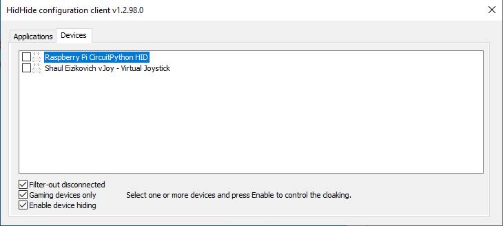
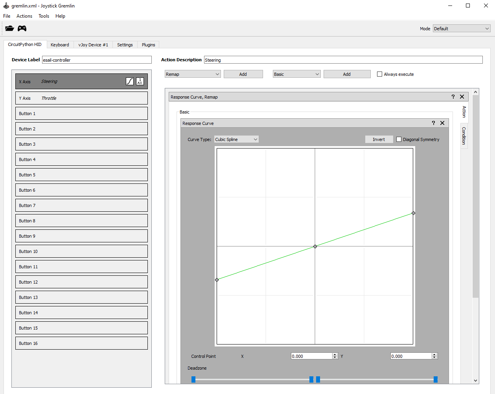
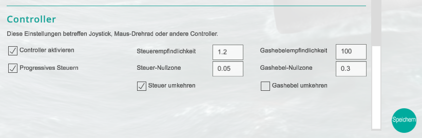

# Custom Made eSail Controller

Created by Deepwin, 06.03.2023

## Introduction

This document describes a weekend project in which I have implemented a custom made steering will and throttle for the [eSail](https://www.esailyachtsimulator.com/) simulator. Below you can see the final setup:


I wanted to have a setup that gives a similar experience as real sailing. Unfortunately, the gaming controllers and wheels on the market do not work well. For instance racing wheels have a spring, that automatically centers the wheel. The only throttles are those for flight simulators.

To see the controller in action visit this [video](https://youtu.be/DC0lWL9rUmc).

## Hardware

This is what you need to rebuild this setup:

- Raspbery Pi Pico
- M5Stack [Angle Sensor](https://docs.m5stack.com/en/unit/angle)
- Some wood, bearings for the wheel and throttle and motivation for crafting

Overall hardware cost is below 20 USD.

## Software

This is the list of software you require and must download:

- [Thonny](https://thonny.org/) to edit python code and download to Pico
- [vJoy](https://sourceforge.net/projects/vjoystick/) to create a virtual joystick
- [Joystick Gremlin](https://github.com/WhiteMagic/JoystickGremlin) to configure virtual joystick and link to phyysical device (Pico)
- [HidHide](https://github.com/ViGEm/HidHide) to hide physical device (Pico) from eSail.
- [eSail](https://store.steampowered.com/app/794860/ESAIL_SEGELSIMULATOR/) the sailing simulator itself. You need to purchase it.
- [boating](https://github.com/deeepwin/home-gaming/tree/main/boating) with source code (this repo)
- [CircuitPython 7.3](https://adafruit-circuit-python.s3.amazonaws.com/bin/raspberry_pi_pico/en_US/adafruit-circuitpython-raspberry_pi_pico-en_US-7.3.2.uf2) the firmware for Pico. I test with 7.3.
- [CircuitPython Library](https://circuitpython.org/libraries) download version 7.3 to be compatible with firmware.


## Install Instructions

1. Install Thonny, vJoy, Joystick Gremlin, HidHide and eSail.
2. Press button in Raspberry Pi Pico and connect USB to PC.
3. Copy .uf2 file to Pico using file explorer in Microsoft Windows.
4. Unplug and plug Pico. Circuit Python will now boot up.
5. Unzip Circuit Python library and copy the following folder and files to lib/ folder on Pico:
   - `adafruit_display_text` folder
   - `adafruit_hid` folder
   - `adafruit_displayio_ssd1306.mpy` file
   - `adafruit_framebuf.mpy` file
   - `adafruit_ssd1306.mpy` file 
6. Then copy the `boating` file to the root folder of the Pico, possibly overwriting existing files:
   - `boot.py`
   - `code.py`
   - `hid_gamepad.py`

After doing this step the Pico will start up as game controller and should be visible in Microsoft Windows device overview.

## Configuration

Configuration is not so straight forward. eSail does not offer much flexibility at this point in time. Nevertheless, the presented solution offers good convenience.

1. Startup HidHide and ensure to un-tick the Pico. We want it visible.



2. Start up Gremlin and load the configuration file `gremlin.xml` provided with this repo. You should see this:


 
Press `Active` button on top left in Gremlin (game controller button)

3. Make Pico invisible by ticking it in HidHide. Note you should see a virtual vJoy device as well. Leave it un-ticked as this will be the device eSail is accessing.


4. Startup eSail go under settings and adjust them according to following screen shot:



Exit settings and try if steering wheel and throttle works as expected. Have fun.

## Explanations

### Steering Wheel Control

eSail expects joystick X-signal as control signal for the steering wheel. However, it appears the acceptable value range is from -1.0 to 1.0. The Pico however is configured as `game pad` with a joystick and value range of -127 to 127. Gremlin converts this range. The code on Pico that does this is in `code.py`.

```
# update values directly in joystick
x = range_map(int(x_value), -x_max_range, x_max_range, -127, 127)
y = range_map(int(y_value), -y_max_range, y_max_range, -127, 127)
    
gp.move_joysticks(
    x=x,
    y=y,
)
```

I have added a filter to remove jitter in the signal.

```
x_value = x_filter * 0.9 + x_value * 0.1
x_filter = x_value
```
You can adjust the constants, if filtering is too slow. It is important to tick `progressive control` in eSail settings. Otherwise it will not work.

### Throttle

Unfortunately eSail has no `progressive control` for throttle control. That's why I came up with a separate logic for throttle control that reflects reality best.

```
if throttle_pos == 0 and throttle_value != 0:
    press_button(Keycode.C)
    throttle_value = 0
else:
    if throttle_pos > throttle_value:
        press_button(Keycode.S)
        throttle_value += 1
        
    if throttle_pos < throttle_value:
        press_button(Keycode.W)
        throttle_value -= 1
```

This simulates actual button presses. eSail receives key code accordingly and it is possible to control throttle. If throttle is center, it sends `c` key to disconnect gear and stop propeller. If throttle is moved, a counter follow the position and presses a certain amount of `w` or `s` key to accelerate or decelerate. For a range of 15000 LSB it will generate 10 key strokes. This is configured here:

```
# handle throttle control
throttle_pos = int(round((10.0 / 15000.0) * y_value))
```

Please also note, that there is a filter for the throttle position.

```
y_value = y_filter * 0.8 + y_value * 0.2
y_filter = y_value
```

Like for steering it is a recursive filter to smoothen the input signal.

### Zero Position Calibration

Make sure to center steering wheel and throttle before you plug in the Raspberry Pi Pico. The Pico will use current reading to make an offset calibration. This way values sent to eSail are always centered.

```
# calibrate to zero on startup
x_offset, y_offset = read_analog()

# initialize filters
y_filter = y_offset
x_filter = x_offset
```

This is it. Hopefully eSail provides more controller options in the future to make this procedure smoother.


